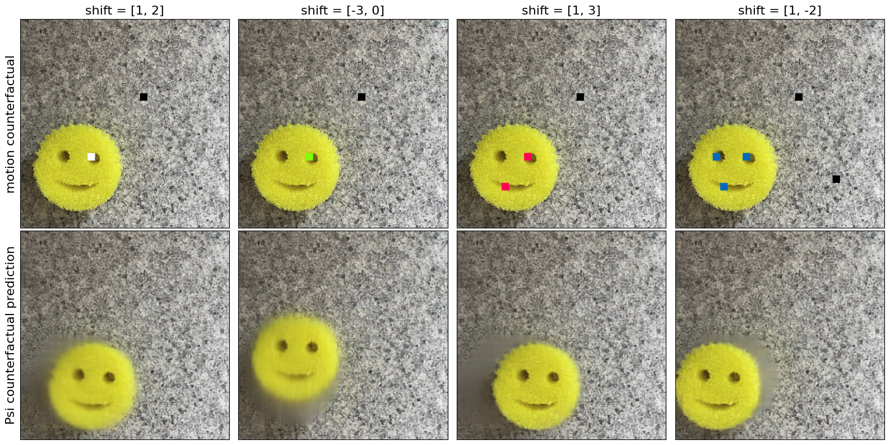
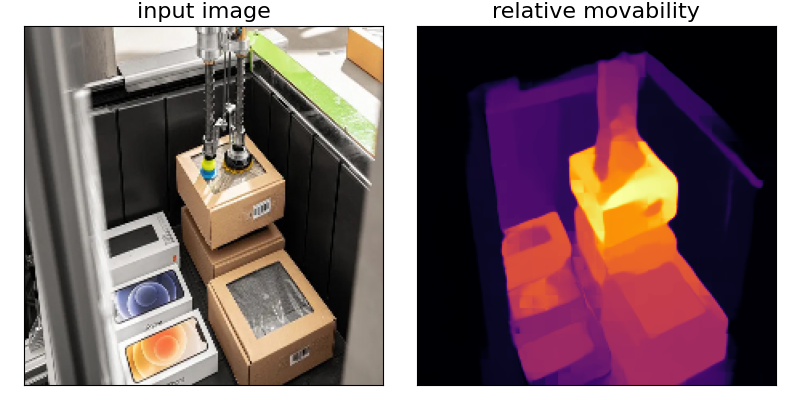

# Counterfactual World Models
This is the official implementation of 

[Unifying (Machine) Vision via Counterfactual World Modeling](https://arxiv.org/abs/2306.01828)  
Daniel M. Bear, Kevin Feigelis, Honglin Chen, Wanhee Lee, Rahul Venkatesh, Klemen Kotar, Alex Durango, Daniel L.K. Yamins

See [Setup](#Setup) below to install. To reference our work, please use [Citation](#Citation).


## Demos of using CWMs to generate "counterfactual" simulations and analyze scenes

Counterfactual World Models (CWMs) can be prompted with "counterfactual" visual inputs: "What if?" questions about slightly perturbed versions of real scenes.

Beyond generating new, simulated scenes, properly prompting CWMs can reveal the underlying physical structure of a scene. For instance, asking which points would also move along with a selected point is a way of segmenting a scene into independently movable "Spelke" objects.

The provided notebook demos are a subset of the use cases described in [our paper](https://arxiv.org/abs/2306.01828).

### Making factual and counterfactual predictions with a pretrained CWM

Run the jupyter notebook `CounterfactualWorldModels/demo/FactualAndCounterfactual.ipynb`

#### Factual predictions
Given all of one frame and a few patches of a subsequent frame from a real video, a CWM makes predictions about the rest of the second frame. The ability to prompt the CWM with a small number of tokens relies on training with a very small number of patches revealed in the second frame. 


#### Counterfactual simulations
A small number of patches (colored) in a _single image_ can be selected to counterfactually move in a chosen direction, while other patches (black) are static. This produces object movement in the intended directions.


### Segmenting Spelke objects by applying motion-counterfactuals

Run the jupyter notebook `CounterfactualWorldModels/demo/SpelkeObjectSegmentation.ipynb`

Users can upload their own images on which to run counterfactuals.

#### Example Spelke objects from interactive motion counterfactuals
In each row, one patch is selected to move "upward" (green square) and in the last two rows, one patch is selected to remain static (red square). The optical flow resulting from the simulation represents the CWM's implicit segmentation of the moved object. In the last row, the implied segment includes both the robot arm and the object it is grasping, as the CWM predicts they will move as a unit.


### Estimating the movability of elements of a scene

Run the jupyter notebook `CounterfactualWorldModels/demo/MovabilityAndMotionCovariance.ipynb`

#### Example estimate of movability 
A number of motion counterfactuals were randomly sampled (i.e. patches placed throughout the input image and moved.) This produces a "movability" heatmap of which parts of a scene tend to move and which tend to remain static. Spelke objects are inferred to be most movable, while the background rarely moves.


#### Example estimate of counterfactual motion covariance at selected (cyan) points
By inspecting the pixel-pixel covariance across many motion counterfactuals, we can estimate which parts of a scene move together on average. Shown are maps of what tends to move along with a selected point (cyan.) Objects adjacent to one another tend to move together, as some motion counterfactuals include collisions between them; however, motion counterfactuals in the appropriate direction can isolate single Spelke objects (see above.)


## Setup
We recommend installing required packages in a virtual environment, e.g. with venv or conda.

1. clone the repo: `git clone https://github.com/neuroailab/CounterfactualWorldModels.git`
2. install requirements and `cwm` package: `cd CounterfactualWorldModels && pip install -e .`

Note: If you want to run models on a CUDA backend with [Flash Attention](https://github.com/HazyResearch/flash-attention) (recommended), 
it needs to be installed separately via [these instructions](https://github.com/HazyResearch/flash-attention#installation-and-features).

### Pretrained Models
Weights are currently available for three VMAEs trained with the _temporally-factored masking policy_:
- A [ViT-base VMAE with 8x8 patches](https://counterfactual-world-modeling.s3.amazonaws.com/cwm_baseVMAE_224px_8x8patches_2frames.pth), trained 3200 epochs on Kinetics400
- A [ViT-large VMAE with 4x4 patches](https://counterfactual-world-modeling.s3.amazonaws.com/cwm_largeVMAE_224px_4x4patches_2frames.pth), trained 100 epochs on Kinetics700 + Moments + (20% of Ego4D)
- A [ViT-base VMAE with 4x4 patches](https://counterfactual-world-modeling.s3.amazonaws.com/cwm_IMUcond_conjVMAE_224px_4x4patches_2frames.pth), conditioned on both IMU and RGB video data (otherwise same as above)

See demo jupyter notebooks for urls to download these weights and load them into VMAEs.

These notebooks also download weights for other models required for some computations:
- A [ViT that predicts IMU](https://counterfactual-world-modeling.s3.amazonaws.com/flow2imu_conjVMAE_224px.pth) from a 2-frame RGB movie (required for running the IMU-conditioned VMAE)
- A pretrained [RAFT](https://github.com/princeton-vl/RAFT) optical flow model
- A pretrained [RAFT _architecture_ optimized to predict keypoints](https://counterfactual-world-modeling.s3.amazonaws.com/raft_consolidated_keypoint_predictor.pth) in a single image. (See paper for definition.)


### Coming Soon!
- [ ] Fine control over counterfactuals (multiple patches moving in different directions)
- [ ] Iterative algorithms for segmenting Spelke objects
- [ ] Using counterfactuals to estimate other scene properties
- [ ] Model training code

## Citation
If you found this work interesting or useful in your own research, please cite the following:
```bibtex
@misc{bear2023unifying,
      title={Unifying (Machine) Vision via Counterfactual World Modeling}, 
      author={Daniel M. Bear and Kevin Feigelis and Honglin Chen and Wanhee Lee and Rahul Venkatesh and Klemen Kotar and Alex Durango and Daniel L. K. Yamins},
      year={2023},
      eprint={2306.01828},
      archivePrefix={arXiv},
      primaryClass={cs.CV}
}
```
