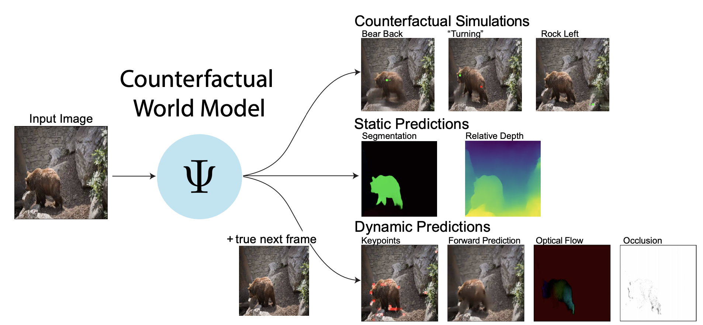
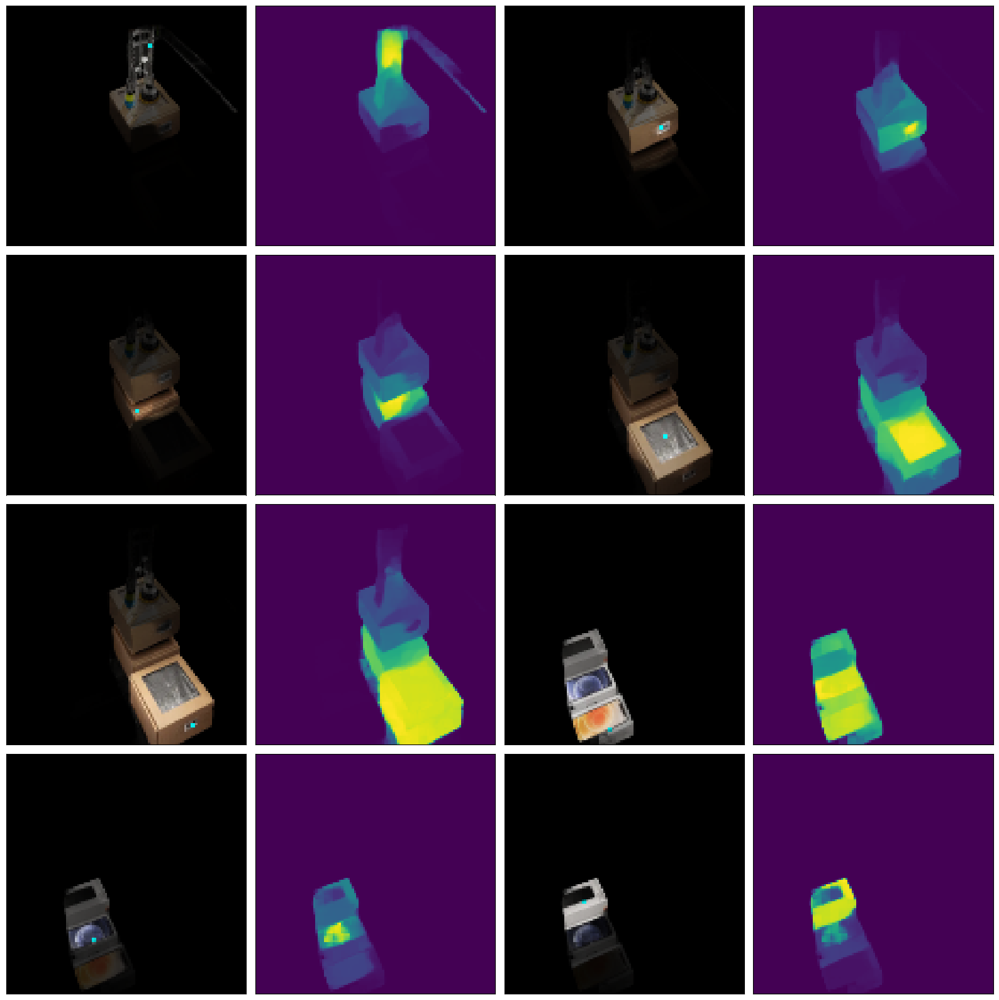

# Counterfactual World Models
This is the official implementation of [Unifying (Machine) Vision via Counterfactual World Modeling](https://arxiv.org/abs/2306.01828),
an approach to building promptable, purely visual "foundation models."

See [Setup](#Setup) below.




## Demos of using CWMs to analyze physical properties of scenes

These are a subset of the use cases described in [our paper](https://arxiv.org/abs/2306.01828).

### Run a demo of making factual and counterfactual predictions

Run the jupyter notebook `CounterfactualWorldModels/demo/FactualAndCounterfactual.ipynb`

#### factual predictions


#### counterfactual predictions


### Run a demo of segmenting Spelke objects by applying motion-counterfactuals

Run the jupyter notebook `CounterfactualWorldModels/demo/SpelkeObjectSegmentation.ipynb`

Users can upload their own images on which to run counterfactuals.

#### Example Spelke objects from interactive motion counterfactuals


### Run a demo of estimating the movability of elements of a scene

Run the jupyter notebook `CounterfactualWorldModels/demo/MovabilityAndMotionCovariance.ipynb`

#### Example estimate of movability 


#### Example estimate of counterfactual motion covariance at selected (cyan) points


## Setup
We recommend installing required packages in a virtual environment, e.g. with venv or conda.

1. clone the repo: `git clone https://github.com/neuroailab/CounterfactualWorldModels.git`
2. install requirements and `cwm` package: `cd CounterfactualWorldModels && pip install -e .`

Note: If you want to run models on a CUDA backend with [Flash Attention](https://github.com/HazyResearch/flash-attention) (recommended), 
it needs to be installed separately via [these instructions](https://github.com/HazyResearch/flash-attention#installation-and-features).

### Pretrained Models
Weights are currently available for three VMAEs trained with the _temporally-factored masking policy_:
- A [ViT-base VMAE with 8x8 patches](https://counterfactual-world-modeling.s3.amazonaws.com/cwm_baseVMAE_224px_8x8patches_2frames.pth), trained 3200 epochs on Kinetics400
- A [ViT-large VMAE with 4x4 patches](https://counterfactual-world-modeling.s3.amazonaws.com/cwm_largeVMAE_224px_4x4patches_2frames.pth), trained 100 epochs on Kinetics700 + Moments + (20% of Ego4D)
- A [ViT-base VMAE with 4x4 patches](https://counterfactual-world-modeling.s3.amazonaws.com/cwm_IMUcond_conjVMAE_224px_4x4patches_2frames.pth), conditioned on both IMU and RGB video data (otherwise same as above)

See demo jupyter notebooks for urls to download these weights and load them into VMAEs.

These notebooks also download weights for other models required for some computations:
- A [ViT that predicts IMU](https://counterfactual-world-modeling.s3.amazonaws.com/flow2imu_conjVMAE_224px.pth) from a 2-frame RGB movie (required for running the IMU-conditioned VMAE)
- A pretrained [RAFT](https://github.com/princeton-vl/RAFT) optical flow model
- A pretrained [RAFT _architecture_ optimized to predict keypoints](https://counterfactual-world-modeling.s3.amazonaws.com/raft_consolidated_keypoint_predictor.pth) in a single image. (See paper for definition.)


### Coming Soon!
- [ ] Fine control over counterfactuals (multiple patches moving in different directions)
- [ ] Iterative algorithms for segmenting Spelke objects
- [ ] Using counterfactuals to estimate other scene properties
- [ ] Model training code

## Citation
If you found this work interesting or useful in your own research, please cite the following:
```bibtex
@misc{bear2023unifying,
      title={Unifying (Machine) Vision via Counterfactual World Modeling}, 
      author={Daniel M. Bear and Kevin Feigelis and Honglin Chen and Wanhee Lee and Rahul Venkatesh and Klemen Kotar and Alex Durango and Daniel L. K. Yamins},
      year={2023},
      eprint={2306.01828},
      archivePrefix={arXiv},
      primaryClass={cs.CV}
}
```
